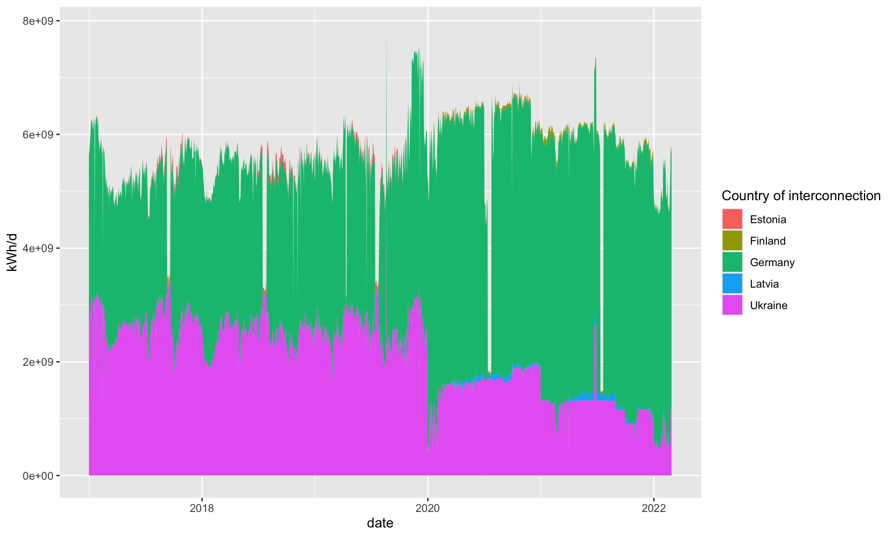

# entsog
Collecting data from ENTSO-G platform


## Example
```{r}
library(remotes)
remotes::install_github("energyandcleanair/entsog")

library(entsog)
library(tidyverse)

operators <- entsog::operators()

operators_russia <- operators %>%
  filter(operatorCountryLabel=="Russia")

interconnections_russia <-
  entsog::interconnections(from_operator_key = operators_russia$operatorKey)

flows_russia <- entsog::physical_flows(
  operator_key = interconnections_russia$toOperatorKey,
  point_key = interconnections_russia$toPointKey,
  direction = "entry",
  date_from="2017-01-01")


flows_russia %>%
 left_join(operators %>% distinct(operatorKey, operatorCountryLabel)) %>%
  group_by(date, operatorCountryLabel) %>%
  summarise_at("value", sum, na.rm=T) %>%
  ungroup() %>%
  ggplot() +
  geom_area(aes(date, value, fill=operatorCountryLabel)) +
  scale_fill_discrete(name="Country of interconnection") +
  labs(y=unique(flows_russia$unit))
  
```


